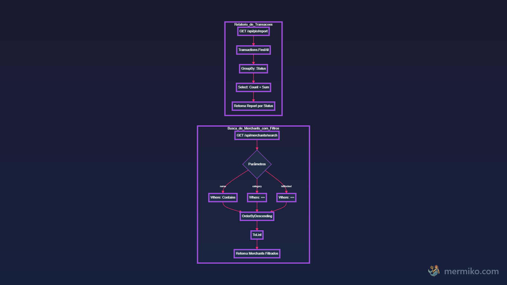

# 🏦 SafePIX - Documentação Geral do Projeto

## 👥 Equipe de Desenvolvimento

Este projeto é desenvolvido por estudantes da FIAP da 3ESPV:

- **Henrique Parra Benitez** (RM551973) - 3ESPV  

- **Roberto Oliveira Azzalin Navas** (RM551460) - 3ESPV  

- **Tony Willian da Silva Segalin** (RM550667) - 3ESPV  

- **Guilherme Barreto** (RM98939) - 3ESPV  

- **Nicolas Oliveira** (RM550667) - 3ESPV  

---

## 📋 Sobre o Projeto

### O que é o SafePIX?

O **SafePIX** é um sistema bancário inteligente desenvolvido em **ASP.NET Core Web API** que detecta e bloqueia automaticamente transferências PIX destinadas a casas de apostas. O projeto demonstra a aplicação prática de conceitos avançados de desenvolvimento web com integração de APIs públicas e banco de dados NoSQL.

### Contexto Acadêmico

Este projeto foi desenvolvido para a **FIAP - Sprint 4**, atendendo aos seguintes critérios de avaliação:

| Critério | Peso | Implementação |
|----------|------|---------------|
| **ASP.NET Core Web API com CRUD completo (NoSQL)** | 35% | 4 controllers com 20 endpoints |
| **Pesquisas com LINQ** | 10% | Filtros e agregações com LINQ |
| **Integração com API pública** | 20% | ReceitaWS para validação de CNPJ |

### Problema que Resolve

O sistema identifica automaticamente empresas do setor de apostas através da API ReceitaWS e bloqueia transferências PIX para esses estabelecimentos, registrando o bloqueio para auditoria.

---

## 🛠️ Tecnologias Utilizadas

### Stack Principal

- **.NET 9.0** - Framework de desenvolvimento
- **ASP.NET Core Web API** - Framework para APIs REST
- **LiteDB 5.0.21** - Banco de dados NoSQL local (arquivo único)
- **Swagger/OpenAPI** - Documentação interativa da API
- **C# 13** - Linguagem de programação

### Pacotes NuGet

```xml
<PackageReference Include="LiteDB" Version="5.0.21" />
<PackageReference Include="Swashbuckle.AspNetCore" Version="6.5.0" />
<PackageReference Include="Microsoft.AspNetCore.OpenApi" Version="9.0.9" />
```

### API Externa

- **ReceitaWS** - API pública gratuita para consulta de CNPJ (https://receitaws.com.br)

---

## 🏗️ Arquitetura do Código

### Estrutura de Pastas

```
xp-bank/
│
├── Controllers/              # Endpoints REST da API
│   ├── UsersController.cs        → CRUD de usuários
│   ├── AccountsController.cs     → CRUD de contas bancárias
│   ├── MerchantsController.cs    → CRUD de merchants + busca LINQ
│   └── PixController.cs          → Transferências PIX + relatórios
│
├── Models/                   # Entidades do domínio
│   ├── User.cs                   → Usuário do sistema
│   ├── Account.cs                → Conta bancária
│   ├── Merchant.cs               → Estabelecimento que recebe PIX
│   └── Transaction.cs            → Transação PIX
│
├── DTOs/                     # Data Transfer Objects
│   ├── CreateUserDto.cs          → Input para criar usuário
│   ├── UpdateUserDto.cs          → Input para atualizar usuário
│   ├── CreateAccountDto.cs       → Input para criar conta
│   ├── UpdateAccountDto.cs       → Input para atualizar conta
│   ├── CreateMerchantDto.cs      → Input para criar merchant
│   ├── UpdateMerchantDto.cs      → Input para atualizar merchant
│   ├── TransferPixDto.cs         → Input para transferência PIX
│   └── TransactionReportDto.cs   → Output de relatórios
│
├── Services/                 # Lógica de negócio
│   ├── ReceitaWsService.cs       → Integração com API ReceitaWS
│   ├── MerchantService.cs        → Validação e busca de merchants
│   └── PixService.cs             → Transferências e relatórios
│
├── Data/                     # Acesso ao banco de dados
│   └── LiteDbContext.cs          → Contexto LiteDB (4 coleções)
│
├── Program.cs                # Configuração da aplicação
└── appsettings.json          # Configurações
```

### Responsabilidades de Cada Camada

#### Controllers (Camada de Apresentação)
- Recebem requisições HTTP
- Validam DTOs de entrada
- Chamam Services
- Retornam respostas HTTP (200, 201, 400, 404, etc.)

#### Models (Camada de Domínio)
- Representam as entidades do sistema
- Mapeadas diretamente para o banco LiteDB
- Contêm atributo `[BsonId]` para identificação

#### DTOs (Objetos de Transferência)
- Separam a API dos modelos internos
- Permitem evoluir a API sem quebrar o banco
- Validações de entrada

#### Services (Camada de Negócio)
- Contêm regras de negócio
- Integração com APIs externas
- Consultas LINQ complexas
- Validações de domínio

#### Data (Camada de Acesso a Dados)
- Gerencia conexão com LiteDB
- Expõe coleções para CRUD
- Configuração do banco

---

## 🚀 Como Executar o Projeto

### Pré-requisitos

- **.NET 9.0 SDK** instalado ([Download](https://dotnet.microsoft.com/download))
- **Nenhuma configuração adicional** necessária!

### Passo a Passo

#### 1. Navegar para o diretório do projeto

```bash
cd "A:\1henrique\FIAP\c-sharp\sprint 4\xp-bank"
```

#### 2. Restaurar dependências (primeira vez)

```bash
dotnet restore
```

#### 3. Compilar o projeto

```bash
dotnet build
```

#### 4. Executar a aplicação

```bash
dotnet run
```

#### 5. Acessar o Swagger

Abra o navegador em:
- **HTTPS**: https://localhost:5001
- **HTTP**: http://localhost:5000

O Swagger abrirá automaticamente com todos os endpoints documentados!

### Banco de Dados

O LiteDB criará automaticamente o arquivo de banco de dados no diretório do projeto na primeira execução. Não é necessário nenhuma configuração ou instalação adicional.

---

## ✨ Funcionalidades Principais

### 1. Gestão de Usuários

- Criar, listar, buscar, atualizar e deletar usuários
- Campos: Nome, Email
- Controle automático de data de criação

### 2. Gestão de Contas Bancárias

- CRUD completo de contas
- Saldo controlado
- Número da conta
- Associação com usuário
- Buscar contas por usuário específico

### 3. Gestão de Merchants (Estabelecimentos)

- CRUD completo de merchants
- **Validação automática de CNPJ** via API ReceitaWS
- **Detecção automática de casas de apostas**
- Bloqueio automático quando detectado
- **Busca avançada com filtros LINQ** (nome, categoria, bloqueados)

### 4. Transferências PIX

- Transferir valor entre conta e merchant
- **Validação de saldo** antes da transferência
- **Bloqueio automático** para merchants de apostas
- Histórico completo de transações
- **Relatório agregado** por status (completed, blocked, pending)

---

## 📡 Endpoints da API

### 👥 Users (`/api/users`)

| Método | Endpoint | Descrição |
|--------|----------|-----------|
| GET | `/api/users` | Listar todos os usuários |
| GET | `/api/users/{id}` | Buscar usuário por ID |
| POST | `/api/users` | Criar novo usuário |
| PUT | `/api/users/{id}` | Atualizar usuário |
| DELETE | `/api/users/{id}` | Deletar usuário |

**Exemplo de Request:**
```json
POST /api/users
{
  "name": "João Silva",
  "email": "joao@email.com"
}
```

---

### 💰 Accounts (`/api/accounts`)

| Método | Endpoint | Descrição |
|--------|----------|-----------|
| GET | `/api/accounts` | Listar todas as contas |
| GET | `/api/accounts/{id}` | Buscar conta por ID |
| GET | `/api/accounts/user/{userId}` | Buscar contas de um usuário |
| POST | `/api/accounts` | Criar nova conta |
| PUT | `/api/accounts/{id}` | Atualizar conta |
| DELETE | `/api/accounts/{id}` | Deletar conta |

**Exemplo de Request:**
```json
POST /api/accounts
{
  "userId": "67291abc...",
  "initialBalance": 1000.00,
  "accountNumber": "12345-6"
}
```

---

### 🏪 Merchants (`/api/merchants`)

| Método | Endpoint | Descrição |
|--------|----------|-----------|
| GET | `/api/merchants` | Listar todos os merchants |
| GET | `/api/merchants/{id}` | Buscar merchant por ID |
| **GET** | **`/api/merchants/search`** | **Busca com filtros LINQ** 🔥 |
| POST | `/api/merchants` | Criar merchant (valida CNPJ) |
| PUT | `/api/merchants/{id}` | Atualizar merchant |
| DELETE | `/api/merchants/{id}` | Deletar merchant |

**Exemplo de Request:**
```json
POST /api/merchants
{
  "name": "Bet365 Brasil",
  "cnpj": "12345678000190",
  "category": "Apostas"
}
```

**Busca com LINQ (Query Parameters):**
```
GET /api/merchants/search?name=Bet&category=Apostas&isBlocked=true
```

---

### 💸 PIX (`/api/pix`)

| Método | Endpoint | Descrição |
|--------|----------|-----------|
| POST | `/api/pix/transfer` | Realizar transferência PIX |
| GET | `/api/pix/transactions` | Listar todas as transações |
| **GET** | **`/api/pix/report`** | **Relatório agregado (LINQ)** 🔥 |

**Exemplo de Transferência:**
```json
POST /api/pix/transfer
{
  "fromAccountId": "67291def...",
  "toMerchantId": "67291xyz...",
  "amount": 100.00
}
```

**Resposta de Bloqueio:**
```json
{
  "message": "Transferência bloqueada: Bet365 Brasil é uma casa de apostas",
  "transaction": {
    "status": "blocked",
    "blockedReason": "Transferência bloqueada: Bet365 Brasil é uma casa de apostas"
  }
}
```

---

## 🎯 Demonstração dos Critérios da Sprint 4

### ✅ Critério 1: CRUD Completo com NoSQL (35%)

#### Onde está no código:

**Controllers:**
- `Controllers/UsersController.cs` (linhas 1-83)
- `Controllers/AccountsController.cs` (linhas 1-99)
- `Controllers/MerchantsController.cs` (linhas 1-107)
- `Controllers/PixController.cs` (linhas 1-54)

**Exemplo de CRUD no código:**
```csharp
// UsersController.cs

[HttpGet]
public ActionResult<List<User>> GetAll()
{
    var users = _context.Users.FindAll().ToList();
    return Ok(users);
}

[HttpGet("{id}")]
public ActionResult<User> GetById(string id)
{
    var user = _context.Users.FindById(new ObjectId(id));
    if (user == null)
        return NotFound(new { message = "Usuário não encontrado" });
    return Ok(user);
}

[HttpPost]
public ActionResult<User> Create([FromBody] CreateUserDto dto)
{
    var user = new User
    {
        Id = ObjectId.NewObjectId(),
        Name = dto.Name,
        Email = dto.Email
    };
    _context.Users.Insert(user);
    return CreatedAtAction(nameof(GetById), new { id = user.Id }, user);
}

[HttpPut("{id}")]
public ActionResult Update(string id, [FromBody] UpdateUserDto dto)
{
    var user = _context.Users.FindById(new ObjectId(id));
    if (user == null) return NotFound();
    
    if (!string.IsNullOrEmpty(dto.Name)) user.Name = dto.Name;
    if (!string.IsNullOrEmpty(dto.Email)) user.Email = dto.Email;
    
    _context.Users.Update(user);
    return Ok(user);
}

[HttpDelete("{id}")]
public ActionResult Delete(string id)
{
    var deleted = _context.Users.Delete(new ObjectId(id));
    if (!deleted) return NotFound();
    return NoContent();
}
```

#### Como testar no Swagger:

1. Acesse https://localhost:5001
2. Expanda `/api/users`
3. Teste cada operação: POST → GET → PUT → DELETE
4. Repita para `/api/accounts` e `/api/merchants`

#### Banco de Dados NoSQL:

**LiteDbContext.cs:**
```csharp
public class LiteDbContext
{
    private readonly LiteDatabase _database;
    
    public ILiteCollection<User> Users => _database.GetCollection<User>("Users");
    public ILiteCollection<Account> Accounts => _database.GetCollection<Account>("Accounts");
    public ILiteCollection<Merchant> Merchants => _database.GetCollection<Merchant>("Merchants");
    public ILiteCollection<Transaction> Transactions => _database.GetCollection<Transaction>("Transactions");
}
```

**Por que LiteDB?**
- NoSQL (como MongoDB)
- Zero configuração
- Arquivo local
- API similar ao MongoDB
- Perfeito para desenvolvimento e demonstração

---

### ✅ Critério 2: Pesquisas com LINQ (10%)

#### Onde está no código:

**Arquivo:** `Services/MerchantService.cs` (linhas 48-70)

**Filtros com LINQ:**
```csharp
public List<Merchant> Search(string? name = null, string? category = null, bool? isBlocked = null)
{
    var query = _context.Merchants.FindAll().AsEnumerable();

    // Filtro por nome usando Where + Contains
    if (!string.IsNullOrEmpty(name))
    {
        query = query.Where(m => m.Name.Contains(name, StringComparison.OrdinalIgnoreCase));
    }

    // Filtro por categoria usando Where
    if (!string.IsNullOrEmpty(category))
    {
        query = query.Where(m => m.Category == category);
    }

    // Filtro por bloqueado usando Where
    if (isBlocked.HasValue)
    {
        query = query.Where(m => m.IsBlocked == isBlocked.Value);
    }

    // Ordenação usando OrderByDescending
    return query
        .OrderByDescending(m => m.CreatedAt)
        .ToList();
}
```

**Arquivo:** `Services/PixService.cs` (linhas 98-112)

**Agregação com LINQ (GroupBy + Count + Sum):**
```csharp
public List<TransactionReportDto> GetReport()
{
    var report = _context.Transactions
        .FindAll()
        .GroupBy(t => t.Status)              // ← Agrupa por status
        .Select(g => new TransactionReportDto
        {
            Status = g.Key,                   // ← Nome do grupo
            Count = g.Count(),                // ← Conta transações
            TotalAmount = g.Sum(t => t.Amount) // ← Soma valores
        })
        .ToList();

    return report;
}
```

#### Como testar no Swagger:

**Filtros:**
```
GET /api/merchants/search?name=Bet
GET /api/merchants/search?category=Varejo
GET /api/merchants/search?isBlocked=true
GET /api/merchants/search?name=Bet&isBlocked=true (múltiplos filtros)
```

**Agregação:**
```
GET /api/pix/report
```

Retorna:
```json
[
  {
    "status": "completed",
    "count": 5,
    "totalAmount": 750.00
  },
  {
    "status": "blocked",
    "count": 2,
    "totalAmount": 300.00
  }
]
```

#### Operações LINQ Demonstradas:

- ✅ **Where** - Filtragem condicional
- ✅ **Contains** - Busca por substring
- ✅ **OrderByDescending** - Ordenação
- ✅ **GroupBy** - Agrupamento
- ✅ **Count** - Contagem
- ✅ **Sum** - Soma
- ✅ **Select** - Projeção

---

### ✅ Critério 3: Integração com API Pública (20%)

#### Onde está no código:

**Arquivo:** `Services/ReceitaWsService.cs` (linhas 1-105)

**Consulta na API ReceitaWS:**
```csharp
public async Task<ReceitaWsResponse?> ConsultarCnpjAsync(string cnpj)
{
    try
    {
        // Remove caracteres especiais do CNPJ
        cnpj = cnpj.Replace(".", "").Replace("/", "").Replace("-", "");

        // Chama API pública ReceitaWS
        var response = await _httpClient.GetFromJsonAsync<ReceitaWsResponse>(
            $"https://www.receitaws.com.br/v1/cnpj/{cnpj}"
        );

        return response;
    }
    catch (Exception ex)
    {
        _logger.LogError(ex, "Erro ao consultar CNPJ {Cnpj}", cnpj);
        return null;
    }
}
```

**Detecção de Casas de Apostas:**
```csharp
public bool IsEmpresaDeApostas(ReceitaWsResponse? response)
{
    if (response == null) return false;

    var termosApostas = new[] { "aposta", "jogo", "loteria", "cassino", "bet", "gaming" };

    // Verifica na atividade principal (CNAE)
    if (response.AtividadePrincipal != null)
    {
        foreach (var atividade in response.AtividadePrincipal)
        {
            if (termosApostas.Any(termo => 
                atividade.Text?.Contains(termo, StringComparison.OrdinalIgnoreCase) == true))
            {
                return true;
            }
        }
    }

    // Verifica no nome fantasia
    if (!string.IsNullOrEmpty(response.Fantasia) && 
        termosApostas.Any(termo => response.Fantasia.Contains(termo, ...)))
    {
        return true;
    }

    // Verifica na razão social
    if (!string.IsNullOrEmpty(response.Nome) && 
        termosApostas.Any(termo => response.Nome.Contains(termo, ...)))
    {
        return true;
    }

    return false;
}
```

**Arquivo:** `Services/MerchantService.cs` (linhas 23-46)

**Integração no Fluxo:**
```csharp
public Merchant Create(Merchant merchant)
{
    // 1. Consulta a API ReceitaWS
    var receitaInfo = _receitaWsService.ConsultarCnpjAsync(merchant.Cnpj)
        .GetAwaiter().GetResult();

    if (receitaInfo != null)
    {
        // 2. Verifica se é empresa de apostas
        if (_receitaWsService.IsEmpresaDeApostas(receitaInfo))
        {
            merchant.IsBlocked = true;
            _logger.LogWarning("Merchant {Name} bloqueado automaticamente", merchant.Name);
        }

        // 3. Atualiza nome com dados da Receita
        if (!string.IsNullOrEmpty(receitaInfo.Nome))
        {
            merchant.Name = receitaInfo.Nome;
        }
    }

    _context.Merchants.Insert(merchant);
    return merchant;
}
```

**Arquivo:** `Services/PixService.cs` (linhas 42-63)

**Bloqueio de Transferências:**
```csharp
// Verifica se merchant está bloqueado
if (merchant.IsBlocked)
{
    var transaction = new Transaction
    {
        Status = "blocked",
        BlockedReason = $"Transferência bloqueada: {merchant.Name} é uma casa de apostas"
    };

    _context.Transactions.Insert(transaction);
    
    _logger.LogWarning(
        "Transferência bloqueada para merchant {MerchantName} (casa de apostas)", 
        merchant.Name
    );

    return (false, transaction.BlockedReason, transaction);
}
```

#### Como testar:

1. **Criar merchant com termo "Bet" ou "Aposta":**
```json
POST /api/merchants
{
  "name": "Bet365 Brasil",
  "cnpj": "12345678000190",
  "category": "Apostas"
}
```

2. **Verificar resposta** - `isBlocked` deve ser `true`

3. **Tentar transferir PIX** para esse merchant

4. **Verificar bloqueio** - Retorna erro 400 com mensagem

---

## 🎬 Fluxo de Uso Completo

### Cenário: Criar usuário, conta e tentar transferir para casa de apostas

#### Passo 1: Criar Usuário
```
POST /api/users
Body: { "name": "Maria Santos", "email": "maria@email.com" }
Retorno: { "id": "abc123...", ... }
```

#### Passo 2: Criar Conta
```
POST /api/accounts
Body: { "userId": "abc123...", "initialBalance": 1000, "accountNumber": "12345" }
Retorno: { "id": "def456...", "balance": 1000, ... }
```

#### Passo 3: Criar Merchant Normal
```
POST /api/merchants
Body: { "name": "Supermercado", "cnpj": "11222333000181", "category": "Varejo" }
Retorno: { "id": "ghi789...", "isBlocked": false, ... }
```

#### Passo 4: Criar Merchant de Apostas
```
POST /api/merchants
Body: { "name": "Bet365", "cnpj": "99999999000199", "category": "Apostas" }
Retorno: { "id": "jkl012...", "isBlocked": true, ... }  ← BLOQUEADO!
```

#### Passo 5: Transferir para Merchant Normal
```
POST /api/pix/transfer
Body: { "fromAccountId": "def456...", "toMerchantId": "ghi789...", "amount": 100 }
Retorno: { "message": "Transferência realizada com sucesso", ... }
Status: 200 OK ✅
```

#### Passo 6: Transferir para Casa de Apostas
```
POST /api/pix/transfer
Body: { "fromAccountId": "def456...", "toMerchantId": "jkl012...", "amount": 50 }
Retorno: { "message": "Transferência bloqueada...", ... }
Status: 400 Bad Request ❌
```

#### Passo 7: Ver Relatório (LINQ)
```
GET /api/pix/report
Retorno:
[
  { "status": "completed", "count": 1, "totalAmount": 100 },
  { "status": "blocked", "count": 1, "totalAmount": 50 }
]
```

#### Passo 8: Buscar Merchants Bloqueados (LINQ)
```
GET /api/merchants/search?isBlocked=true
Retorno: [ { "id": "jkl012...", "name": "Bet365", "isBlocked": true, ... } ]
```

---

## 💻 Código-Fonte Explicado

### 1. Configuração Principal (Program.cs)

```csharp
var builder = WebApplication.CreateBuilder(args);

// Adiciona Controllers
builder.Services.AddControllers();

// Registra LiteDB Context como Singleton
builder.Services.AddSingleton<LiteDbContext>();

// Configura HttpClient para ReceitaWS
builder.Services.AddHttpClient<ReceitaWsService>();

// Registra Services
builder.Services.AddScoped<MerchantService>();
builder.Services.AddScoped<PixService>();

// Configura Swagger
builder.Services.AddSwaggerGen(c =>
{
    c.SwaggerDoc("v1", new OpenApiInfo
    {
        Title = "SafePIX API",
        Version = "v1",
        Description = "Sistema de Bloqueio de PIX para Casas de Apostas - LiteDB Local"
    });
});

var app = builder.Build();

app.UseSwagger();
app.UseSwaggerUI();
app.MapControllers();

app.Run();
```

### 2. Models (Entidades)

**User.cs:**
```csharp
public class User
{
    [BsonId]
    public ObjectId Id { get; set; }
    public string Name { get; set; } = string.Empty;
    public string Email { get; set; } = string.Empty;
    public DateTime CreatedAt { get; set; } = DateTime.UtcNow;
}
```

**Account.cs:**
```csharp
public class Account
{
    [BsonId]
    public ObjectId Id { get; set; }
    public string UserId { get; set; } = string.Empty;
    public decimal Balance { get; set; }
    public string AccountNumber { get; set; } = string.Empty;
    public DateTime CreatedAt { get; set; } = DateTime.UtcNow;
}
```

**Merchant.cs:**
```csharp
public class Merchant
{
    [BsonId]
    public ObjectId Id { get; set; }
    public string Name { get; set; } = string.Empty;
    public string Cnpj { get; set; } = string.Empty;
    public string Category { get; set; } = string.Empty;
    public bool IsBlocked { get; set; } = false;  // ← Bloqueio automático
    public DateTime CreatedAt { get; set; } = DateTime.UtcNow;
}
```

**Transaction.cs:**
```csharp
public class Transaction
{
    [BsonId]
    public ObjectId Id { get; set; }
    public string FromAccountId { get; set; } = string.Empty;
    public string ToMerchantId { get; set; } = string.Empty;
    public decimal Amount { get; set; }
    public string Status { get; set; } = "pending"; // pending, completed, blocked
    public DateTime CreatedAt { get; set; } = DateTime.UtcNow;
    public string? BlockedReason { get; set; }      // ← Motivo do bloqueio
}
```

### 3. Services (Lógica de Negócio)

#### ReceitaWsService - Integração com API Pública

**Responsabilidades:**
- Consultar CNPJ na ReceitaWS
- Identificar empresas de apostas
- Retornar dados da empresa

**Métodos principais:**
- `ConsultarCnpjAsync(string cnpj)` - Chama API externa
- `IsEmpresaDeApostas(ReceitaWsResponse)` - Detecta casa de apostas

#### MerchantService - Validação de Merchants

**Responsabilidades:**
- Criar merchant com validação de CNPJ
- Buscar merchants com filtros LINQ
- Atualizar merchant

**Métodos principais:**
- `Create(Merchant)` - Integra ReceitaWS
- `Search(name, category, isBlocked)` - Usa LINQ
- `Update(id, Merchant)` - Revalida CNPJ

#### PixService - Transferências PIX

**Responsabilidades:**
- Validar transferências
- Bloquear transferências suspeitas
- Gerar relatórios

**Métodos principais:**
- `Transfer(TransferPixDto)` - Valida e executa
- `GetAllTransactions()` - Lista transações
- `GetReport()` - Agrega com LINQ

---

## 📊 Resumo de Avaliação

### Checklist para o Professor

#### CRUD Completo (35%)

- [ ] ✅ Verificar `Controllers/UsersController.cs` - 5 operações
- [ ] ✅ Verificar `Controllers/AccountsController.cs` - 6 operações
- [ ] ✅ Verificar `Controllers/MerchantsController.cs` - 6 operações
- [ ] ✅ Verificar `Controllers/PixController.cs` - 3 operações
- [ ] ✅ Testar no Swagger cada operação CRUD
- [ ] ✅ Verificar banco NoSQL (LiteDB)

**Evidências:**
- 4 Controllers
- 20 endpoints REST
- LiteDB Context configurado

#### Consultas LINQ (10%)

- [ ] ✅ Verificar `Services/MerchantService.cs` linha 48-70 (filtros)
- [ ] ✅ Verificar `Services/PixService.cs` linha 98-112 (agregação)
- [ ] ✅ Testar `/api/merchants/search?isBlocked=true`
- [ ] ✅ Testar `/api/pix/report`

**Evidências:**
- Where, Contains, OrderByDescending
- **GroupBy + Count + Sum**

#### API Pública (20%)

- [ ] ✅ Verificar `Services/ReceitaWsService.cs` (integração)
- [ ] ✅ Verificar `Services/MerchantService.cs` linha 23-46 (uso da API)
- [ ] ✅ Criar merchant com nome "Bet365" → verificar bloqueio
- [ ] ✅ Tentar transferir para merchant bloqueado → verificar erro

**Evidências:**
- HttpClient configurado
- ReceitaWS integrada
- Bloqueio automático funcionando

---

## 🎓 Demonstração Prática

### Ordem Sugerida de Apresentação

#### 1. Executar o Projeto (30 segundos)
```bash
dotnet run
```
Mostrar: Swagger abrindo automaticamente

#### 2. Demonstrar CRUD (2 minutos)
- Criar usuário no Swagger
- Criar conta
- Mostrar GET, PUT, DELETE

#### 3. Demonstrar LINQ (2 minutos)
- GET `/api/merchants/search?name=Bet` → Explicar Where + Contains
- GET `/api/pix/report` → Explicar GroupBy + Count + Sum
- Mostrar código em `MerchantService.cs` e `PixService.cs`

#### 4. Demonstrar API Pública (3 minutos)
- POST `/api/merchants` com nome "Bet365"
- Mostrar que `isBlocked = true`
- Explicar: "Sistema chamou ReceitaWS e detectou automaticamente"
- POST `/api/pix/transfer` para merchant bloqueado
- Mostrar erro de bloqueio
- Mostrar código em `ReceitaWsService.cs`

**Tempo total: ~7 minutos**

---

## 🏗️ Diagramas de Arquitetura

### 📊 Arquitetura em Camadas


### 🔄 Fluxo de Transferência PIX


### 🗃️ Relacionamento das Entidades


### 🔐 Sequência: Bloqueio Automático


### 📈 Consultas LINQ


### 🔌 Injeção de Dependências


### 📊 Estados da Transação


### 🎯 Visão Geral do Sistema



---
